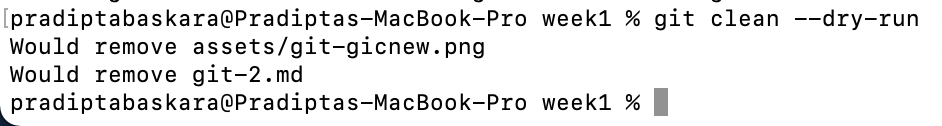

# (Section 3) Git - That One Friend/Foe You Interact with Everyday

## Mistakes
Mistakes happens. It happens a lot of time, whether, whenever, anytime. But that doesn't always mean we are screwed left and right.

This section will explains a few git command that often used when things go south.

### Clean
The command for this is `git clean`. This will delete any untracked files. Things to note that this operation is cannot be undone. Once done, poof, no *revert* to this. But bear in mind, `git clean` alone is not going to delete the untracked files, rather, it will show warning **(thanks git)**. 

We can add `--dry-run` to see which file that is going to be deleted by git. And, add another flag, which is `-f` to do the actual deletion. 

### Reset
This is the command when things go south and you wanna fix a few things. For starters, there are 3 arguments that can be use during this operation
- `git reset --mixed <n HEAD>`
The default operation. Basically, what it does is just shift the current HEAD to n number of previous commit. 
- `git reset --soft <n HEAD>`
This operation is almost the identical with `git reset --mixed`. This operation will move the HEAD to n number of previous commit. And in addition, it will copy all of our data to staged state. Mixed and soft is the non-destructive operation, and most likely the operation we do in many cases.
- `git reset --hard <n HEAD>`
This is the operation that considered (and it is) destructive. Not just moving the HEAD to the n previous commit, and copy the file of that commit to the Staging Area, it also copy to the Working Area, which resulting in any work we did before we do the `git reset` will be lost. Only use this if we absolutely know what we're about to mess.

In many cases, the `git reset --mixed` or `git reset --soft` is already sufficient (or safe if we might say). Like what has been mentioned above, if we're absolutely know what we're going to do, there's nothing wrong with doing `git reset --hard`.

### Revert
Unlike reset, git revert is doing what we call the safe reset. As mentioned above, it already mentioned that doing `--mixed` or `--soft` is the safe options. But bear in mind that doing `git reset` is altering the history, where `git revert`, is actually making a new commit. No history will be altered.

## Rebase
As previously mentioned example, Developer Fabs is developing Feature A, adn Developer Basse is developing Feature B. There will be merging happens when, for example, Developer Fabs finished her works before Developer Basse. At this point, there are chances that Developer Fabs works is conflicting(working on the same file in different branches resulting this) with Developer Basse works. But the main point is, Developer Basse needs the updated master/main branch to get the latest codebase. 

The usual workflow would be, commiting the current changes, checkout to master/main, pull the latest, and merge master/main to the currently developed feature branch. But, here's the catch. Doing this, will add the merge commit into the history. It won't be clean. And that's when Lord Rebase came in, breaking the door and ask *"do you need me?"*

In short, rebase will make the history clean, by changing the parent of the feature to the latest master/main (that has been merged with feature branch that has been developed by Developer Fabs).