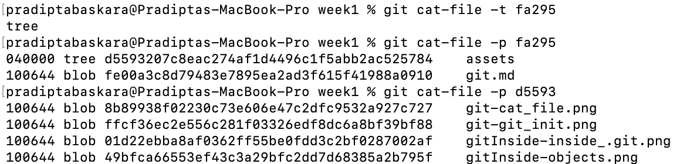
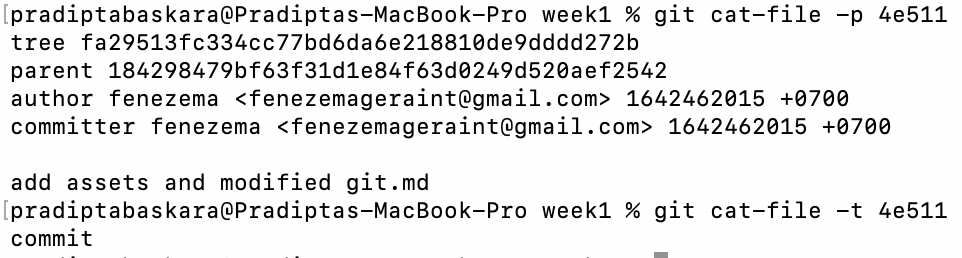
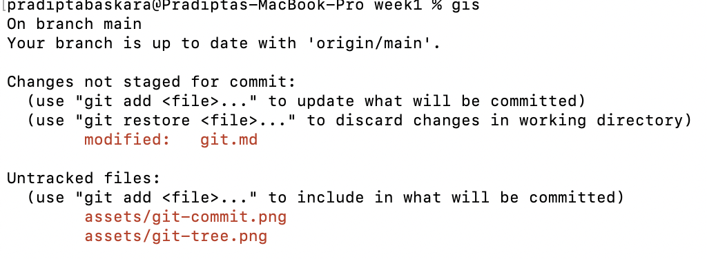
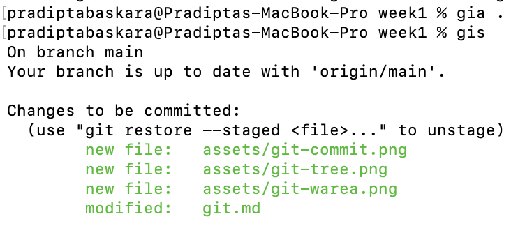
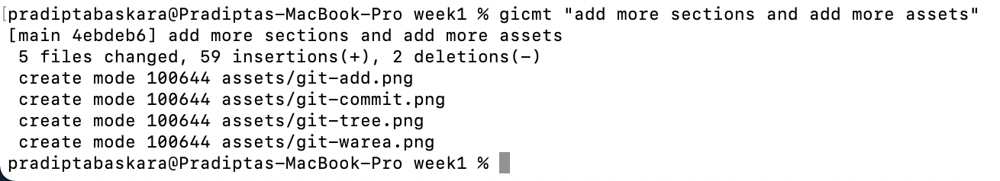

# (Section 1) Git - That One Friend/Foe You Interact with Everyday

## Super Brief Introductory
Developed by Linus Torvalds himself and several maintainers for Linux Kernel development in 2005 as the source code management with BitKeeper, but not so BitKeeper in mind.

## Prerequisite
- Internet connection (but you manage to actually see this, so this one is checked out from the list)
- Git (can be download from [here](https://git-scm.com/downloads), for any OS that suits you)
- Git bash (optional, if you are working on Windows. It is a shell of Git that has a characteristic of unix-like shell terminal, for familiarity purpose, but again, not mandatory. Can be download also from [here](https://git-scm.com/downloads))

## Foundations
In its foundation, Git is almost like a key-value store. In that manner, the key is a [SHA1](https://en.wikipedia.org/wiki/SHA-1), and the value can be either a tree, a blob, or a commit.
All of this informations is stored in a directory called `.git`
One command line to actually pop this directory out in the wild (in your current local repo for this matter) is `git init`

### Init a Repo
As mentioned above, `git init` will init a hidden directory (it is prefixed with `.`, that is why it's hidden) called `.git`.
 
Here, all information regarding any objects, tree, branches (will be explain in the next sections) can be seen here.

### Blob
This type of git object indicates that the git object is a file, regardless the type of the file it might be.
One way to find out the type of git object value is by using `git cat-file -t <SHA1 key>`

Note that the flag `-t` that indicates that command cat-file should print the git object type in the terminal.
If you need to print the content of the git object, flag `-p` can be use instead. 

### Tree
This is one git object that represents the directories. The value of the tree is a pointer, either to another tree, or to a blob. This way, tree can represents directories of your current repo in that matter. 

### Commit
Commit, in a very simple way contains the informations of a few things.
- **Author and comitter (the culprit that did the commit)**
- Date
- **Message**
- **Parent commit (if it not the initial commit)**
- **Tree (which tree it pointed out to)**

 
Note that the only visible information if we use `git cat-file` are the one that printed bold on the list above. The date itself also is the main cause on different results in SHA1 in commits in a way that a commit will never have the same SHA1 key due to date will be different each time.

But you might ask, `"Where can I see the date info on commits?"`. This will be a jumpy, but if it needs to be answered now, you can use this command line `git log` to see the dates. Note that in that regards, you can see a matching SHA1 from the one we see on `.git` directory.

## Git Area(s)
There are 3 majors git areas, Working Area, Staging Area, and Repo. And a very simple flow, or should we say, a happy flow. We will start with the working area. Once done, we can add those changes, and move it to the staging area, while committing will then move them to Repo.

### Working Area
This is where our local development goes. Can also be called working tree. Here, any changes that has not been add and committed will resides. 

Any changes that has not been added to staging area will look like this

 

As you can see, there are changes and new files (annotate as untracked files) in this Working Area. Once we're done, we can add these modified files and untracked files to the Staging Area.

Please note that, based on example above, Working Area and Staging Area is not some place with different locations, but rather a copy of the latest commmit. This also the reason why git can tell which files is being modified, and what new files (untracked) files are there in the Working Area

### Staging Area
So we are ready, and no more changes to be added. This is when we can move all of our modified and untracked files to the staging area.

The git command to do this is by using `git add <path>`

**NB : gia is the alias for git add in my terminal**
As mentioned above, `<path>` is indicating which file should be added to the Staging Area. In our case, `git add .` indicates `please add everything in here (. indicates current directory) to the Staging area`. This also means that if we want to add only some spesific file, let's say (based on image above), we can do:

`git add git.md` 

instead of 

`git add .`

This design basically allowed us to add anything that we need only, to be added to the Staging Area. Or maybe, in some scenario, you want to add other modified file, right after you `git add <path>`. This also can be done by this git design.

**NB : we can use `git restore --staged <path>` to restore anything that already in Staging Area to Working Area if you ever actually need this (*wink-wink)**
**Super NB : `git restore --staged <path>` were introduced in git v2.23.0. Please make sure that your git version match, or higher than v2.23.0 if you want to utilize this command**

### Repo
Repo is the last resort (sort of) once everything that we staged to Staging Area by doing commit. This is where everything resides. 

As you may already know, this is where we type in, in our all might terminal this command

`git commit -m <messages>` (remember messages needs to be between two aphostrophe, as in "initial commit")

**NB : gicmt is just another alias for git commit -m**

