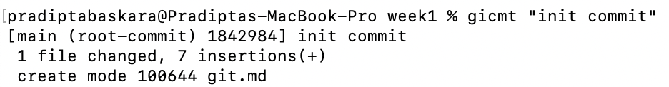
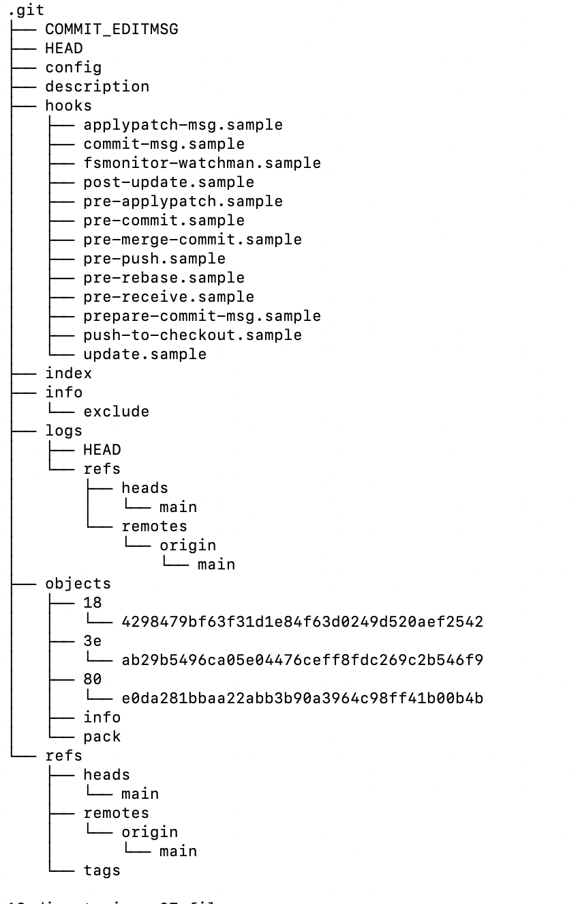
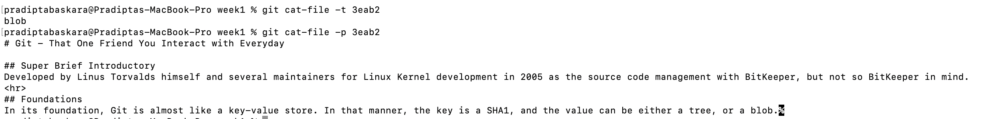

# Git - That One Friend You Interact with Everyday

## Super Brief Introductory
Developed by Linus Torvalds himself and several maintainers for Linux Kernel development in 2005 as the source code management with BitKeeper, but not so BitKeeper in mind.

## Prerequisite
- Internet connection (but you manage to actually see this, so this one is checked out from the list)
- Git (can be download from [here](https://git-scm.com/downloads), for any OS that suits you)
- Git bash (optional, if you are working on Windows. It is a shell of Git that has a characteristic of unix-like shell terminal, for familiarity purpose, but again, not mandatory. Can be download also from [here](https://git-scm.com/downloads))

## Foundations
In its foundation, Git is almost like a key-value store. In that manner, the key is a [SHA1](google.com), and the value can be either a tree, or a blob.
All of this informations is stored in a directory called `.git`
One command line to actually pop this directory out in the wild (in your current local repo for this matter) is `git init`

### Init a Repo
As mentioned above, `git init` will init a hidden directory (it is prefixed with `.`, that is why it's hidden) called `.git`.
 
Here, all information regarding any objects, tree, branches (will be explain in the next sections) can be seen here.

### Blob
This type of git object indicates that the git object is a file, regardless the type of the file it might be.
One way to find out the type of git object value is by using `git cat-file -t <SHA1 key>`

Note that the flag `-t` that indicates that command cat-file should print the git object type in the terminal.
If you need to print the content of the git object, flag `-p` can be use instead. 

### Tree
This is one git object that represents the directories. The value of the tree is a pointer, either to another tree, or to a blob. This way, tree can represents directories of your current repo in that matter. 